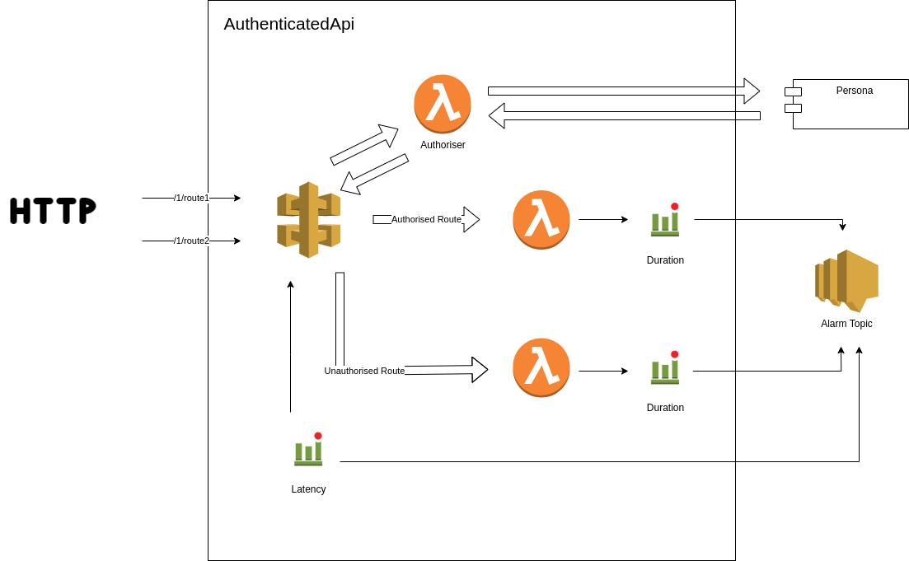

# AuthenticatedApi Example: SimpleAuthenticatedApi

This is an example of using the AuthenticatedApi to create two example API's one authenticated and one not.

The AuthenticatedApi:

- creates an ApiGateway (v2)
- creates an authorisation lambda which authenticates tokens against persona
- creates any number of routes, each with a lambda to handle requests.
- allows authentication to be configured either on all routes or on individual routes
- triggers an alarm if the response time on any route in the api exceeds a configurable duration
- triggers an alarm if the duration of a lambda dealing with the api requests exceeds a configurable duration

## Construct Diagram

## This Example

To build and deploy this example:

- `export AWS_PREFIX=development-XX-` where XX are your initials
  - This is used in the name of the stack and resources created, so that they do not clash with anyone elses stack in AWS
- `source awsenv <profile>` to set your credentials to the shared account
- `npm install`
- `npm run build`
- `cdk deploy`

After you have finished with the example, remove your stack in AWS using:

- `cdk destroy`

## Useful commands

- `npm run build` compile typescript to js
- `npm run watch` watch for changes and compile
- `npm run test` perform the jest unit tests
- `cdk deploy` deploy this stack to your default AWS account/region
- `cdk diff` compare deployed stack with current state
- `cdk synth` emits the synthesized CloudFormation template
