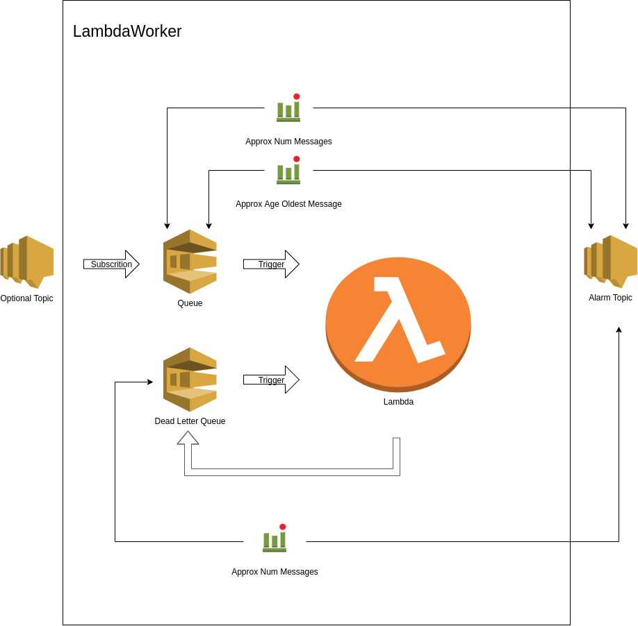

# LambdaWorker Example: SimpleLambdaWorker

This is an example of using the LambdaWorker in a simple worker.

The LambdaWorker:

- is subscribed to an SQS queue whose trigger is enabled by default
- sends failed jobs to another SQS queue - a dead letter queue
- is subscribed to the dead letter queue but this trigger is disabled by default
- allows for the replay of failed jobs with the talis-cli tools awsdlq tool
- triggers an alarm for failed jobs
- triggers an alarm when the queue of jobs exceeds a configuarble maximum threshold
- triggers an alarm when a message waiting on the queue is older than a configurable maximum

Optionionally, the LambdaWorker:

- can have its SQS queue subscribed to an SNS topic.
  - For example all Depot workers subscribe to a "File" topic in a Pub/Sub architecture.
- can have a filterPolicy specified so that it only receives messages from the SNS topic which it is interested in.

## Construct Diagram

## This Example

To build and deploy this example:

- `export AWS_PREFIX=development-XX-` where XX are your initials
  - This is used in the name of the stack and resources created, so that they do not clash with anyone elses stack in AWS
- `source awsenv <profile>` to set your credentials to the shared account
- `npm install`
- `npm run build`
- `cdk deploy`

After you have finished with the example, remove your stack in AWS using:

- `cdk destroy`

## Useful commands

- `npm run build` compile typescript to js
- `npm run watch` watch for changes and compile
- `npm run test` perform the jest unit tests
- `cdk deploy` deploy this stack to your default AWS account/region
- `cdk diff` compare deployed stack with current state
- `cdk synth` emits the synthesized CloudFormation template
